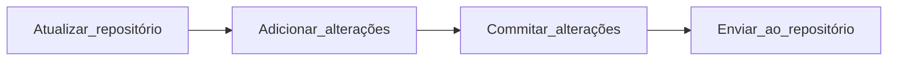

# Tutorial para git em linha de comando
---

O Fluxo de trabalho com o git em linha de comando consiste em:



---

## Atualizar repositório
Entre no repositório desejado no seu computador no seu terminal de linha de comando favorito e use:
```
git pull
```

---
## Subir Mudanças para repositório
Após realizar as mudanças ou a criação de notas no repositório, é o momento de subir suas contribuições para o repositório no Github.

O git tem um fluxo de trabalho, ou uma organização de como inserir alterações no diretório principal do repositório onde estão os arquivos dentro do seu computador (Working Directory):

![[fluxo_de_trabalho_no_git.png]]

---
### Adicionar mudanças no **Index**
A área temporária denominada **Index** é aonde ficam registras as alterações feitas.
```
git add .
ou
git add <nome_do_arquivo_modificado>
```

---
### Realizando um **commit** / enviando alteração para **HEAD**
Uma vez registradas as alterações no **Index** (área temporária), vamos fazer encerrar essa alteração com uma descrição do que foi feito com um *commit* e enviando o registro da alteração para o **HEAD** da árvore do git no seu computador:
```
git commit -m "comentário objetivo descrevendo alteração"
```

Realizado o **commit**, a alteração que você fez está registrada na estrutura do git no seu computador. Você pode commitar várias vezes antes de subir as alterações para o repositório online no Github. Fazer *commits* a cada alteração completa realizada, ajuda a localiza-las depois no histórico de alterações do repositório.

>O comentário em um *commit* serve para localizar no histórico de alterações a modificação feita, podendo ser também uma nota criada ou apagada. Através desse histórico é possível voltar desfazer ações e mapear o desenvolvimento do repositório, por isso é importante seguir as definições de como escrever escrever comentários de commits definidos no [[Guia de estilo de commits]].

---
### Subindo as alterações para o repositório no Github
Após fazer todas as alterações que você desejava, é momento de compartilhar com grupo subindo as alterações para o repositório do cerebroGPI no Github. O comando para subir as alterações é o `git push`:
```
git push origin main
```

---
##### Links Relacionados:  
[https://www.atlassian.com/br/git/tutorials/setting-up-a-repository/git-clone](https://www.atlassian.com/br/git/tutorials/setting-up-a-repository/git-clone)  
[https://rogerdudler.github.io/git-guide/index.pt\_BR.html](https://rogerdudler.github.io/git-guide/index.pt_BR.html)