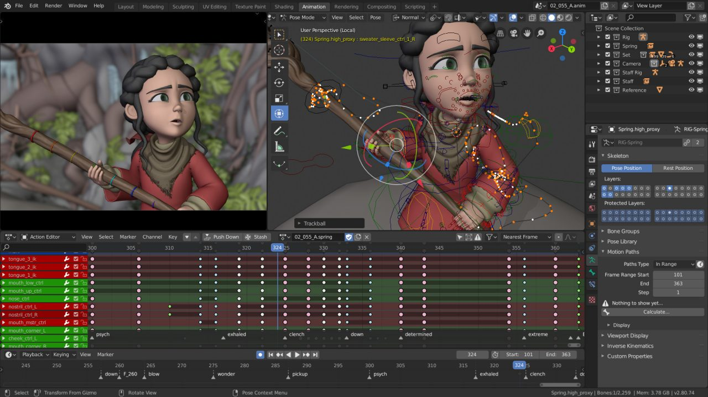

# Tutorial Blender

Blender é um software livre e open source para criação de objetos 3D, modelagem, animação, edição de vídeo, renderização e criação de jogos. É possível utilizar o Blender API para Python, para customizar, criar objetos e ferramentas para Python e Blender, como métodos de otimização em processamento de geometria ou imagens.



## Download do Blender

Se você for usuário de Ubuntu:

```python
$ sudo apt install blender
```

Ou você pode baixar o instalador no site do [Blender](https://www.blender.org/download/)

