# Tutorial Blender

Blender é um software livre e open source para criação de objetos 3D, modelagem, animação, edição de vídeo, renderização e criação de jogos. É possível utilizar o Blender API para Python, para customizar, criar objetos e ferramentas para Python e Blender, como métodos de otimização em processamento de geometria ou imagens.

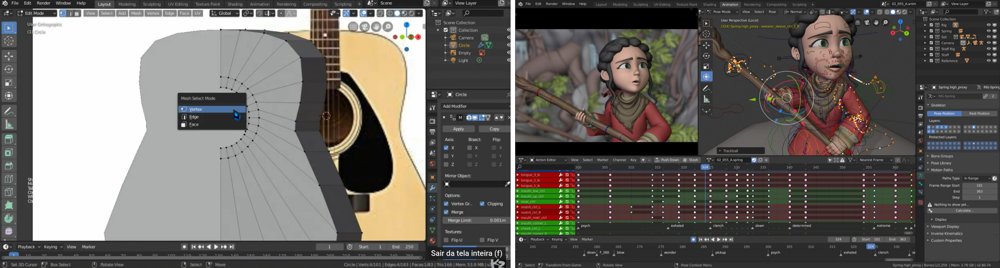

## Download do Blender

Se você for usuário de Ubuntu:

```python
$ sudo apt install blender
```

Ou você pode baixar o instalador no site do [Blender](https://www.blender.org/download/).
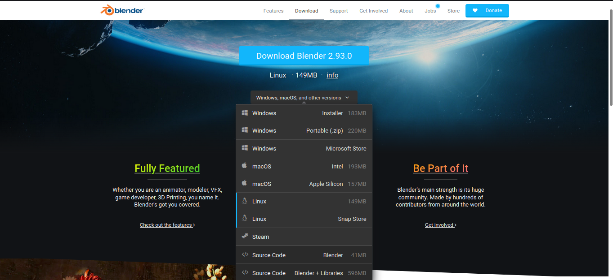

## Área de trabalho

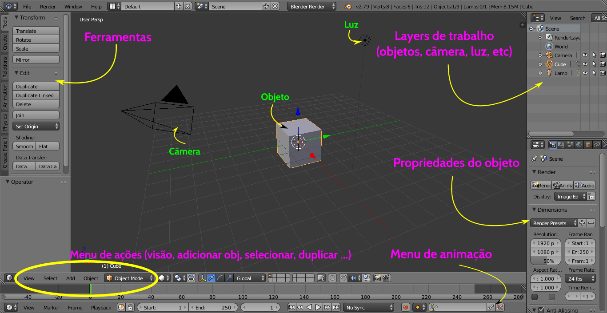

## Alguns atalhos e teclas úteis

**T**: Esconde e abre a caixa de *Ferramentas*
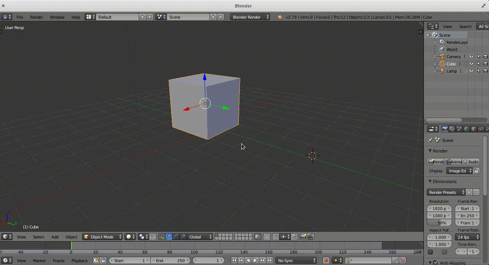

**N**: Esconde e abre a caixa de *Propriedades*
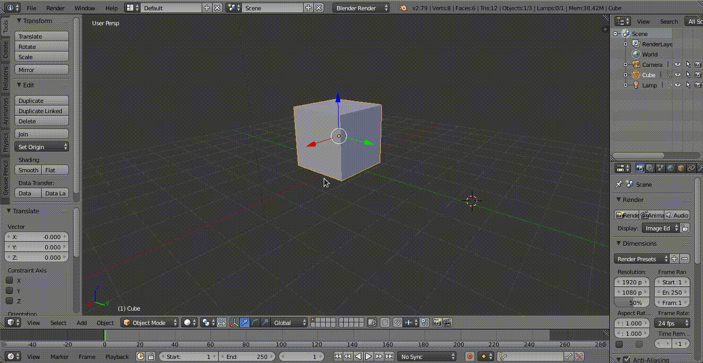

- Para criar objetos, aperte a tecla **T** para abrir a caixa de *Ferramentas*, abra a aba *Create* e selecione o objeto que desejas criar. Para selecionar outro local para criação do objeto, use o **botão esquerdo do mouse** para selecionar o lugar no espaço para criar este objeto.
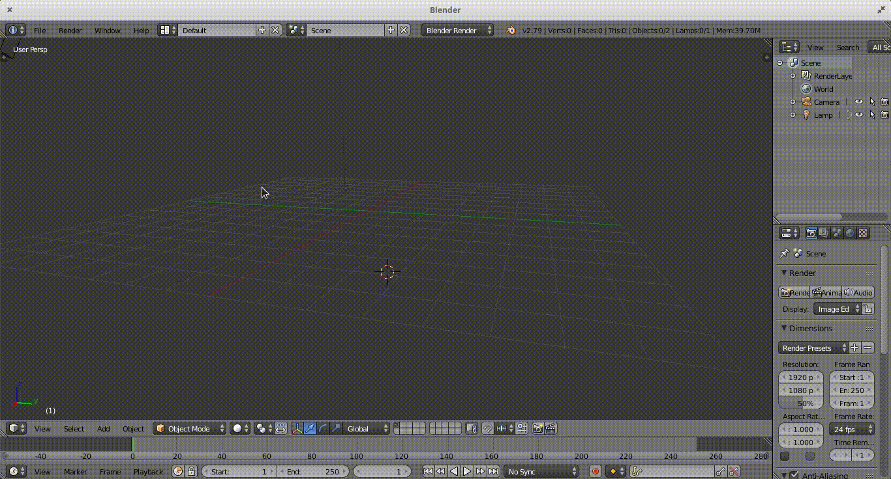

**Pressionar o roll-on do mouse**: Rotaciona a visão


- **Rolar para cima ou para baixo, sem pressionar nenhuma tecla**: Dá zoom na cena (visão)

- **Rolar para cima ou para baixo, pressionando Ctrl**: Movimenta horizontalmenta a cena (visão)

- **Rolar para cima ou para baixo, pressionando Shift**: Dá zoom na cena (visão)

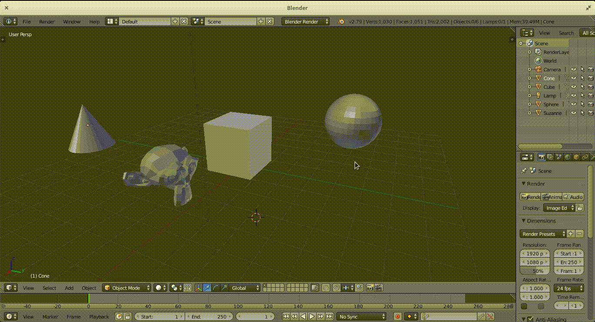

**Clicar com o botão direito do mouse**: Seleciona um objeto (usando Shift, você seleciona mais de um objeto)

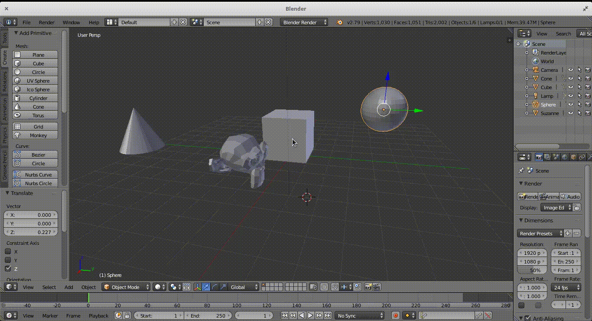

**X**: Para **deletar** objetos, clique com o **botão direito do mouse** nele para selecioná-lo e aperte a tecla **X**. Antes de deletar, surgirá uma caixa em frente ao cursor do seu mouse, para que você confirme se quer deletar mesmo aquele objeto. Ao clicar em *Deletar* neste menu, o objeto será deletado da cena.
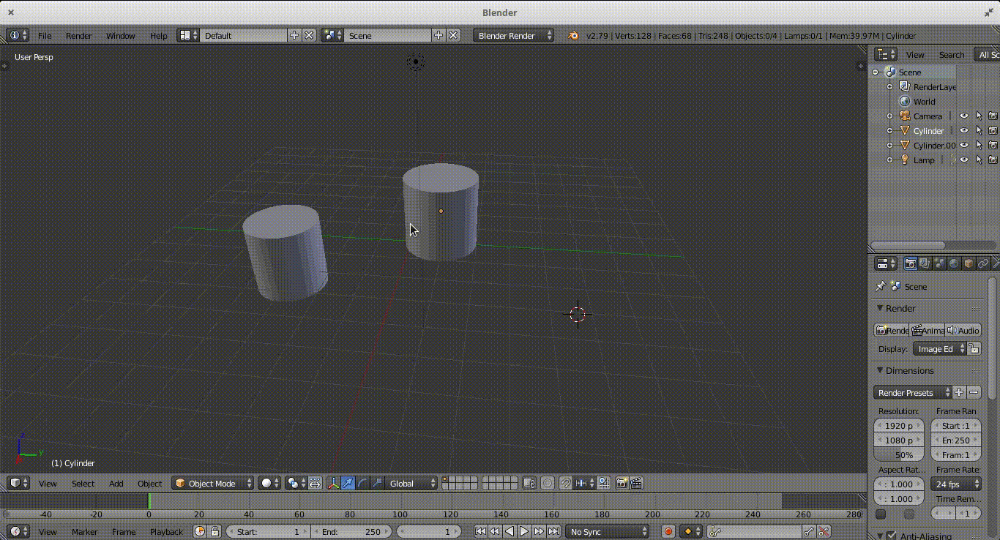

**G**: Para **mover** um objeto selecionado pela cena, clique em **G** para começar o movimento de translação (mover o objeto). 

- Caso queira mover só em um eixo determinado, após apertar **G**, aperte a tecla desse eixo (**X** para mover no eixo X, **Y** para mover no eixo Y e **Z** para mover no eixo Z).

- Caso queira mover mais lentamente o objeto, após apertar **G** (e, caso queira, a tecla de um dos eixos), pressione a tecla **SHIFT**. O mouse entrará em processo de loop, isto é, você moverá o mouse na posição que queira mexer e ele ficará dando loop na tela.
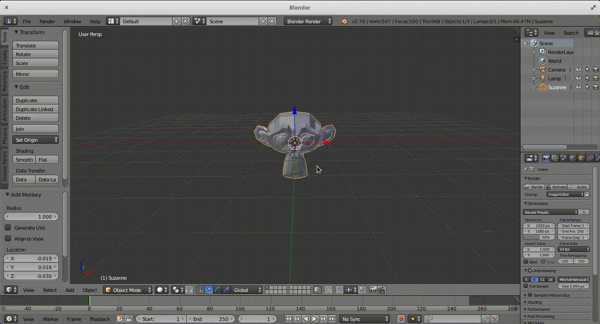

**R**: Para **rotacionar** um objeto selecionado, em relação ao seu centro de massa, clique em **R** para começar o movimento de rotação.

- Caso queira rotacionar em relação a um dos eixos X, Y ou Z, após apertar **R**, aperte a tecla desse eixo  (**X** para girar sobre o eixo X, **Y** para girar sobre o eixo Y e **Z** para girar sobre o eixo Z).

- Caso queira girar mais lentamente o objeto, após apertar **R** (e, caso queira, a tecla de um dos eixos), pressione a tecla **SHIFT**. O mouse entrará em processo de loop, assim como no movimento de translação
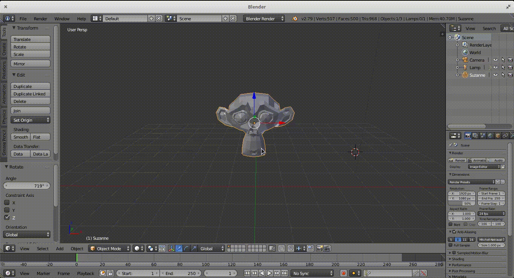

**S**: Para **escalonar** um objeto selecionado, clique em **S** para começar a reduzir ou aumentar seu tamanho.

- Caso queira escalonar apenas em relação a um dos eixos X, Y ou Z, após apertar **S**, aperte a tecla desse eixo  (**X** para escalonar em relação ao eixo X, **Y** para escalonar em relação ao eixo Y e **Z** para escalonar em relação ao eixo Z).

- Caso queira um escalonamento mais reduzido (ou mais lento) do objeto, após apertar **S** (e, caso queira, a tecla de um dos eixos), pressione a tecla **SHIFT**. O mouse entrará em processo de loop, assim como nos outros movimentos


O objeto *ursinho.blend* foi criado usando apenas os movimentos descritos acima. Tenta fazer um desses. :)

### Continua ...


